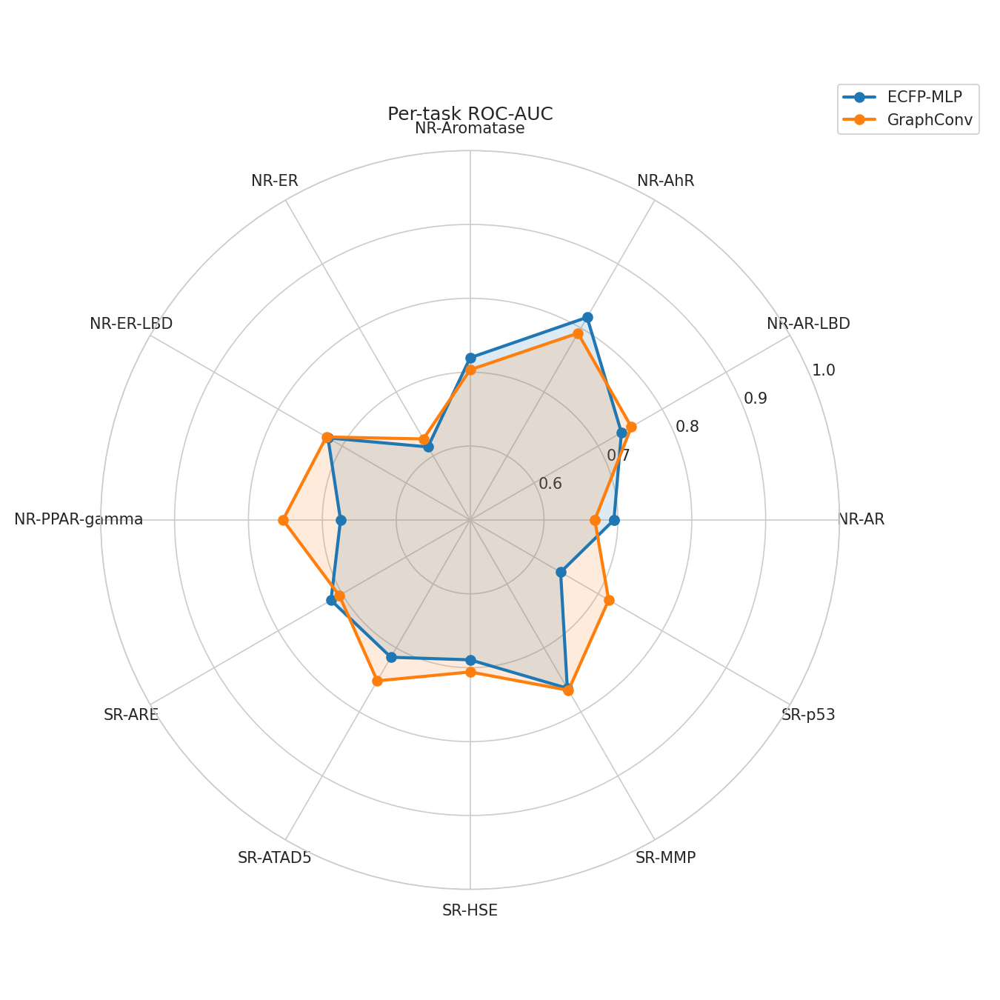
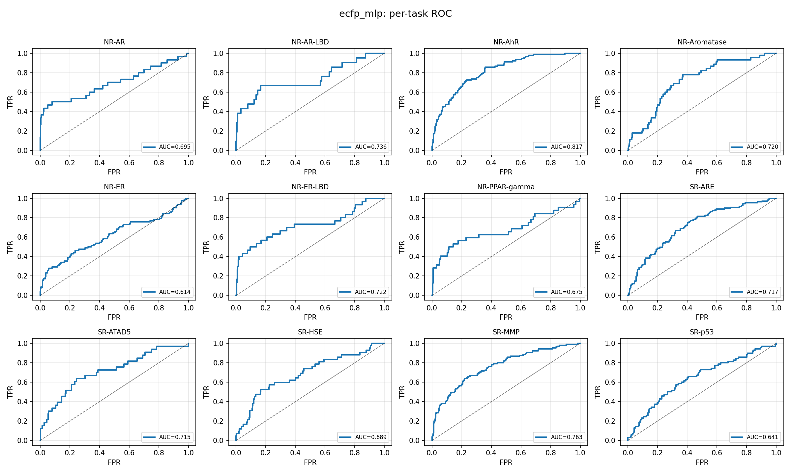

# 🧪 Tox21 Toxicity Classifier — ECFP-MLP vs GraphConv

[](https://colab.research.google.com/github/zqvo04/tox21-toxicity-classifier/blob/main/notebooks/02_ECFP_MLP.ipynb)
[](https://www.python.org/)
[](https://pytorch.org/)
[](https://deepchem.io/)

> **EN** — A multi-label molecular toxicity classifier on the **DeepChem Tox21**
> benchmark, comparing a classical **ECFP fingerprint + MLP** model against a
> **Graph Convolutional Network (GraphConv)**. Built as a cheminformatics +
> deep-learning portfolio project for biotech roles.
>
> **KO** — DeepChem **Tox21** 데이터셋으로 **ECFP 지문 + MLP** 모델과
> **그래프 합성곱 신경망(GraphConv)** 을 비교하는 멀티레이블 독성 분류기.
> 바이오테크 취업용 화학정보학 + 딥러닝 포트폴리오 프로젝트.

---

## 🎯 Overview / 개요

Tox21 은 12개의 독성 엔드포인트(핵수용체 신호 NR-*, 스트레스 반응 SR-*)에 대한
멀티레이블 분류 문제입니다. 레이블에 **결측치(NaN)** 가 많고 클래스 불균형이
심하므로, 본 프로젝트는 **마스킹 손실함수**와 **pos_weight 자동 보정**을 적용합니다.

| 항목 | 내용 |
|------|------|
| Dataset | DeepChem MoleculeNet `tox21` (scaffold split) |
| Tasks | 12 multi-label toxicity endpoints |
| Features | **ECFP** (Morgan, radius=2, 2048 bits) / **MolGraphConvFeaturizer** |
| Models | `ECFPClassifier` (MLP) / `GCNClassifier` (3× GCNConv) |
| Loss | Masked BCE (+pos_weight) / Focal Loss |
| Metrics | per-task ROC-AUC, PR-AUC, F1 + mean ROC-AUC |

---

## 📁 Repository Structure

```
tox21-toxicity-classifier/
├── notebooks/
│   ├── 01_EDA.ipynb          # 레이블 분포, LogP/MW, 분자 구조 시각화
│   ├── 02_ECFP_MLP.ipynb     # ECFP+MLP 학습/평가/ROC
│   ├── 03_GraphConv.ipynb    # GraphConv 학습/평가/ROC
│   └── 04_Comparison.ipynb   # 비교 테이블, 레이더 차트, FN 분석, 화학 해석
├── src/
│   ├── dataset.py            # DeepChem 로딩 + featurizer + NaN 마스킹
│   ├── models.py             # ECFPClassifier, GCNClassifier
│   ├── losses.py             # MaskedBCE, FocalLoss, pos_weight
│   ├── train.py              # 공통 Trainer (early stopping, 체크포인트)
│   └── evaluate.py           # per-task 지표 + ROC plot + FN 추출
├── results/figures/          # 생성된 그림 저장 위치
├── requirements.txt
├── setup_colab.sh            # 검증된 Colab 설치 스크립트
└── README.md
```

---

## 🚀 Quick Start (Google Colab, T4 GPU)

1. 노트북 상단의 **Open In Colab** 배지를 클릭합니다.
2. 첫 셀에서 환경을 설치합니다 (런타임 재시작 안내 시 재시작):
   ```bash
   !bash setup_colab.sh
   ```
3. 노트북을 순서대로 실행합니다:
   `01_EDA → 02_ECFP_MLP → 03_GraphConv → 04_Comparison`
4. 체크포인트 경로(`/content/drive/MyDrive/tox21/`)를 **본인 Google Drive** 경로로 수정하세요.

### Local install

```bash
pip install -r requirements.txt
# PyTorch / PyTorch Geometric 는 CUDA 버전에 맞춰 별도 설치 권장 (setup_colab.sh 참고)
```

---

## 📊 Performance Comparison (placeholder)

> 노트북 04 실행 후 `results/figures/comparison_table.csv` 값으로 갱신하세요.

| Task | ECFP-MLP ROC-AUC | GraphConv ROC-AUC |
|------|:---:|:---:|
| NR-AR | _TBD_ | _TBD_ |
| NR-AR-LBD | _TBD_ | _TBD_ |
| NR-AhR | _TBD_ | _TBD_ |
| NR-Aromatase | _TBD_ | _TBD_ |
| NR-ER | _TBD_ | _TBD_ |
| NR-ER-LBD | _TBD_ | _TBD_ |
| NR-PPAR-gamma | _TBD_ | _TBD_ |
| SR-ARE | _TBD_ | _TBD_ |
| SR-ATAD5 | _TBD_ | _TBD_ |
| SR-HSE | _TBD_ | _TBD_ |
| SR-MMP | _TBD_ | _TBD_ |
| SR-p53 | _TBD_ | _TBD_ |
| **Mean** | **_TBD_** | **_TBD_** |

---

## 🖼️ Results / 결과 이미지

| | |
|---|---|
| 레이블 상관 히트맵 | `results/figures/label_correlation_heatmap.png` |
| 물리화학 특성 분포 | `results/figures/physchem_distributions.png` |
| ECFP ROC curves | `results/figures/ecfp_mlp_roc_curves.png` |
| GraphConv ROC curves | `results/figures/graphconv_roc_curves.png` |
| 모델 비교 레이더 차트 | `results/figures/radar_comparison.png` |
| False Negative 분자 | `results/figures/false_negatives_SR-MMP.png` |
| Structural alerts | `results/figures/structural_alerts.csv` |

```markdown


```

---

## 🧬 Chemical Interpretation / 화학적 해석 요약

ECFP 는 부분구조(substructure) 기반이라 **작용기와 독성의 연관**을 해석하기 좋습니다.
노트북 04 에서 RDKit SMARTS 로 structural alert 별 독성 enrichment 를 계산합니다.

- **Aromatic nitro / amine** — 대사 활성화로 반응성 중간체 형성 → 미토콘드리아 독성(SR-MMP)·유전독성과 연관
- **Michael acceptor / epoxide** — 전자친화성으로 단백질·DNA 공유결합 → 스트레스 경로(SR-ARE, SR-p53) 활성화
- **Halogenated aromatic** — 친유성 증가 → 막 투과 및 AhR 수용체 결합과 관련

**모델 관점**: ECFP-MLP 는 부분구조 alert 를 직접 비트로 인코딩해 해석성이 높고,
GraphConv 는 메시지 전달로 더 유연한 표현을 학습하나 해석성은 낮습니다. 작고
불균형한 Tox21 에서는 두 접근의 평균 ROC-AUC 가 비슷하게 수렴하는 경우가 많습니다.

---

## 🛠️ Tech Stack

DeepChem · PyTorch · PyTorch Geometric · RDKit · scikit-learn · Matplotlib · Seaborn

---

## 📄 License

MIT — for educational and portfolio purposes.
