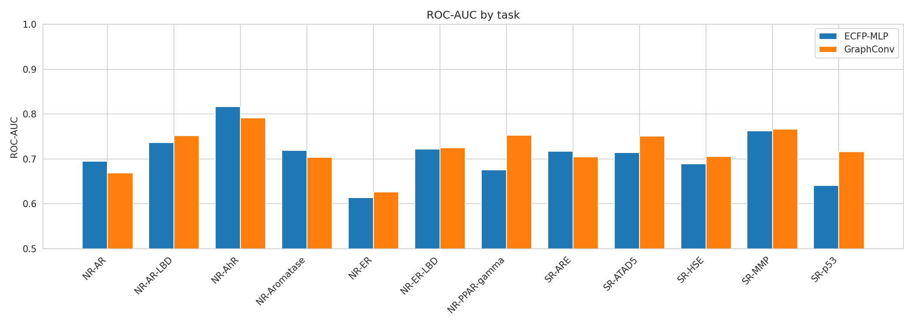
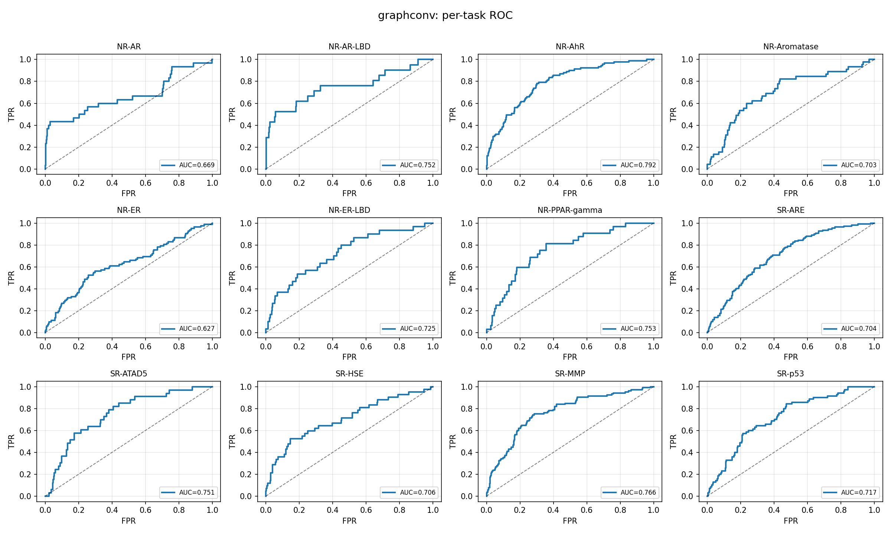
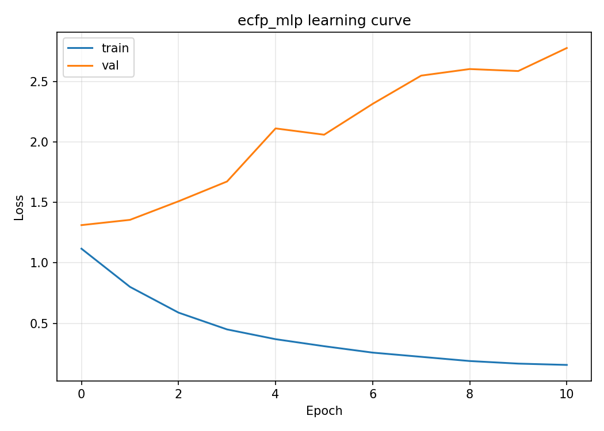
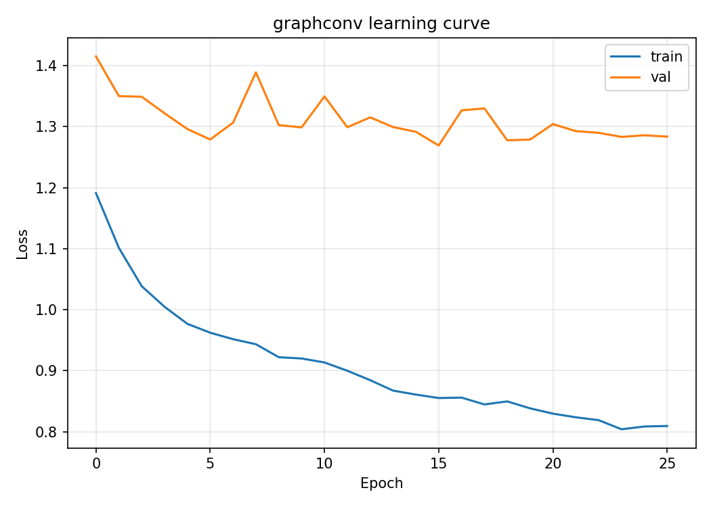
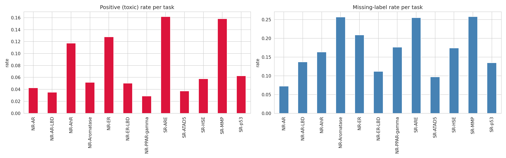
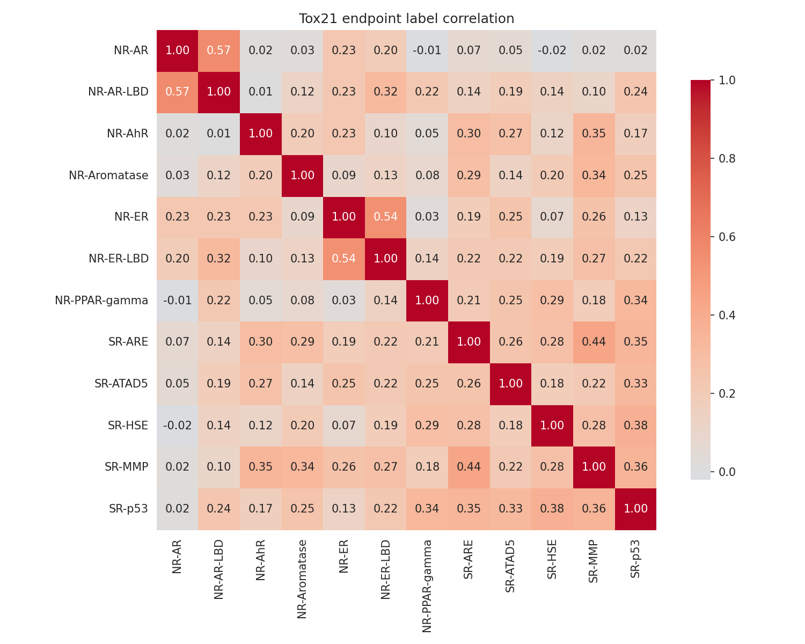
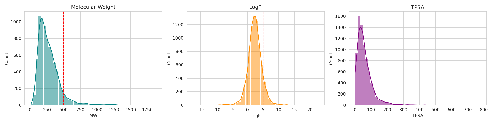
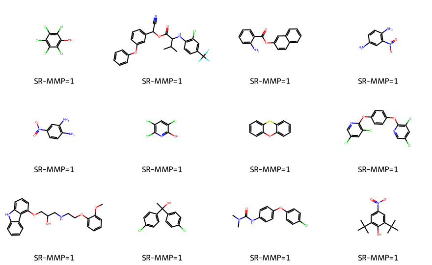
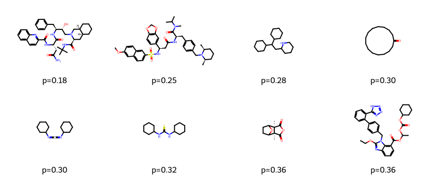

# Tox21 Toxicity Classifier — ECFP-MLP vs GraphConv

[](https://colab.research.google.com/github/zqvo04/tox21-toxicity-classifier/blob/main/notebooks/02_ECFP_MLP.ipynb)
[](https://www.python.org/)
[](https://pytorch.org/)
[](LICENSE)

멀티레이블 분자 독성 분류기 — **ECFP 지문 + MLP** vs **그래프 합성곱 신경망(GCN)** 성능 비교.  
DeepChem Tox21 벤치마크 기반, 바이오테크 취업용 화학정보학 + 딥러닝 포트폴리오 프로젝트.

---

## Overview

Tox21은 12개 독성 엔드포인트에 대한 멀티레이블 분류 문제입니다.  
레이블 결측치(NaN)가 많고 클래스 불균형이 심해 **마스킹 손실함수**와 **pos_weight 자동 보정**을 적용했습니다.

| 항목 | 내용 |
|---|---|
| Dataset | MoleculeNet Tox21 (7,831 molecules, scaffold split 80/10/10) |
| Tasks | 12 multi-label toxicity endpoints (NR-\*, SR-\*) |
| Features | ECFP Morgan fingerprint (radius=2, 2048 bits) / atom-graph (RDKit) |
| Models | ECFPClassifier (MLP 3-layer) / GCNClassifier (GCNConv × 3) |
| Loss | Masked BCE + pos\_weight / Focal Loss (γ=2) |
| Metrics | Per-task ROC-AUC, PR-AUC, F1 + mean ROC-AUC |

---

## Results

### Performance Comparison

| Task | ECFP-MLP ROC-AUC | GraphConv ROC-AUC |
|---|:---:|:---:|
| NR-AR | 0.6946 | 0.6687 |
| NR-AR-LBD | 0.7365 | 0.7519 |
| NR-AhR | **0.8167** | 0.7919 |
| NR-Aromatase | 0.7196 | 0.7032 |
| NR-ER | 0.6142 | 0.6266 |
| NR-ER-LBD | 0.7222 | 0.7247 |
| NR-PPAR-gamma | 0.6754 | **0.7534** |
| SR-ARE | 0.7174 | 0.7045 |
| SR-ATAD5 | 0.7145 | **0.7515** |
| SR-HSE | 0.6893 | 0.7057 |
| SR-MMP | 0.7631 | 0.7662 |
| SR-p53 | 0.6414 | **0.7166** |
| **Mean** | **0.7087** | **0.7221** |

GraphConv가 평균 ROC-AUC에서 소폭 우세(+0.013). ECFP-MLP는 NR-AhR에서 최고 성능(0.817).

### Model Comparison — Radar Chart


### ROC-AUC Bar Chart



### ROC Curves

**ECFP-MLP**


**GraphConv**



### Learning Curves

**ECFP-MLP**



**GraphConv**



---

## EDA

### Label Statistics



### Label Correlation Heatmap



### Physicochemical Distributions



---

## Molecular Visualization

### Example Toxic Molecules



### False Negatives — SR-MMP



---

## Chemical Interpretation

ECFP는 부분구조(substructure) 기반이라 작용기와 독성 연관을 해석하기 좋습니다.

| Structural Alert | 관련 독성 경로 |
|---|---|
| Aromatic nitro / amine | 대사 활성화 → 반응성 중간체 → SR-MMP, 유전독성 |
| Michael acceptor / epoxide | 단백질·DNA 공유결합 → SR-ARE, SR-p53 활성화 |
| Halogenated aromatic | 친유성 증가 → 막 투과, AhR 수용체 결합 |

**모델 관점**: ECFP-MLP는 부분구조 alert를 비트로 직접 인코딩해 해석성이 높고, GraphConv는 메시지 전달로 더 유연한 표현을 학습합니다. 작고 불균형한 Tox21에서는 두 모델의 평균 ROC-AUC가 비슷하게 수렴합니다.

---

## Repository Structure

```
tox21-toxicity-classifier/
├── notebooks/
│   ├── 01_EDA.ipynb           # 레이블 분포, LogP/MW, 분자 구조 시각화
│   ├── 02_ECFP_MLP.ipynb      # ECFP+MLP 학습 / 평가 / ROC
│   ├── 03_GraphConv.ipynb     # GraphConv 학습 / 평가 / ROC
│   └── 04_Comparison.ipynb    # 비교 테이블, 레이더 차트, FN 분석
├── src/
│   ├── dataset.py             # RDKit 기반 데이터 로딩 + scaffold split
│   ├── models.py              # ECFPClassifier, GCNClassifier
│   ├── losses.py              # MaskedBCE, FocalLoss, pos_weight
│   ├── train.py               # Trainer (early stopping, checkpoint)
│   └── evaluate.py            # per-task 지표 + ROC plot + FN 추출
├── results/figures/           # 생성된 그림 / CSV
├── requirements.txt
├── setup_colab.sh
└── README.md
```

---

## Quick Start (Google Colab)

```bash
# 1. 노트북 상단 Open In Colab 배지 클릭
# 2. 첫 번째 셀 실행
!bash setup_colab.sh
# 3. 순서대로 실행: 01_EDA → 02_ECFP_MLP → 03_GraphConv → 04_Comparison
```

### Local Install

```bash
pip install -r requirements.txt
```

---

## Tech Stack

- **RDKit** — 분자 파싱, ECFP(Morgan) 지문, scaffold split
- **PyTorch** — MLP 분류기, 학습 루프
- **PyTorch Geometric** — GCNConv, 그래프 배치 처리
- **scikit-learn** — ROC-AUC, PR-AUC, F1 평가
- **Matplotlib / Seaborn** — 시각화

---

## License

MIT — for educational and portfolio purposes.
